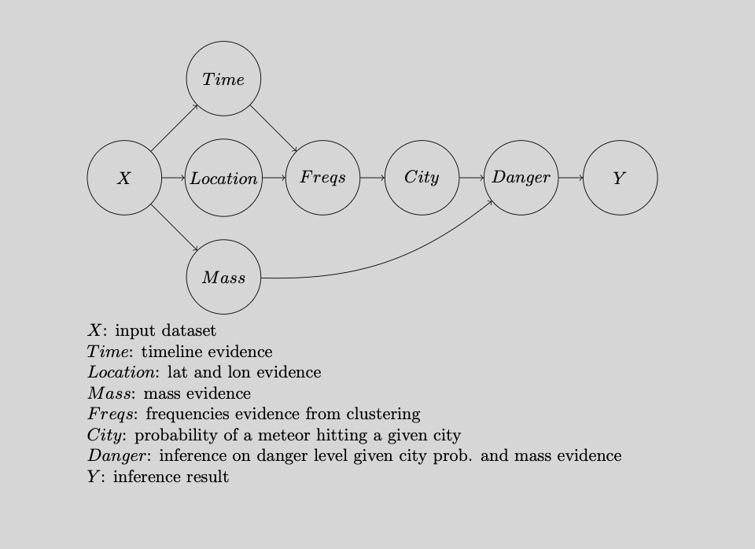

# Meteorite Hotspots
## Abstract
#### Using PEAS (Performance measure, Environment, Actuators, Sensors)
My agent's performance measure will be meteorite landing inference for the purpose of research and worldwide safely prediction by modeling how frequent these meteorites will fall and be considered dangerous based on a historical dataset. My agent will have an observable environment of planet earth, given geographical locations, a timeline, the masses of the meteorites, and more. My agent's actuators will be a predictive outcomes on meteorite landings such as predicting a meteor landing based on the given evidence(clustering data and finding patterns depending on location) and the danger level of a meteorite(which depends on mass and frequencies), all which can be modeled in a probabilistic way using a general pipeline of methods. Lastly, my agent will have sensors of gps (world map), time collection, and meteorite mass measurement.

## My agent's setup
Using the chosen dataset, the main features my model will be utilizing is mass, location, and landings timeline of the metoerites since the purpose is to infer and predict the likelyhood of a meteorite landing on a given location, as well as additionally infering they're danger level, that is when given their mass. 

Here's the pipeline of methods in which the model is structured by:


The pipeline starts with with mass, location , and timeline evidence preprocessed and extracted from the dataset. These are the baseline evidence methods the model depends on for future computations.

Below is the mass method used to extract the feature from the dataset that will be used in future computations (danger method).
```ruby
 # Mass evidence
    def mass_evidence(self, data):
        # relevant column for mass classifications
        extraction = [4]
        # skipping header
        data = [[meteor[i] for i in extraction] for meteor in data[1:]]
        # conversion to np array and removing imputies
        data = np.array([row for row in data if row[0].strip() != ''])
        data = data.astype(float)
        return data
```

On the other hand, the agent also requires a location and timeline method that will preproccess the required features for the clustering algorithm to classify and detect meteorite landing hotspots for the frequencies method of the pipeline.

```ruby
# Time and Location evidence
    def time_location_evidence(self, data):
        # relevant columns for multi-feature clustering (year and coordinate evidence)
        extraction = [6, 7, 8]
        # skipping header
        data = [[meteor[i] for i in extraction] for meteor in data[1:]]
        # conversion to np array and removing imputies
        data = np.array([row for row in data if row[0].strip() != '' and row[1].strip() != '' and row[2].strip() != '']).astype(float)
        return data
```
This method gives is the following 3 dimensional dataset to work with:


The agent needs preproccess the mass, lat, and lon features of the dataset (location and time) because the next method of the model (frequencies) uses them to classify the meteorite landings as clusters, that is, transforming the data into only location and time numerical features for the DBSCAN algorithm. It's important for this model as we can use the time and location variables of the meteorite landings to find patterns by clustering these landings based on their location and time and categorize them as metoerite hotspots. This gives us the following scattar plot:
 

```ruby
def frequencies(self):
        data = self.preprocess()
        if data.size == 0:
            return 'No valid clustering data'
        dbscan = DBSCAN(eps=5, min_samples=2) 
        clusters = dbscan.fit_predict(data[:, :2]) 
        cluster_counts = Counter(clusters)
        data_with_clusters = np.column_stack((data, clusters))
        if -1 in cluster_counts:
            del cluster_counts[-1]
        return cluster_counts, data_with_clusters
```

With this, we have now created a frequencies variable that can now be used to infer the likleyhood of a meteorite landing on given location.

```ruby
def likelyhood_given_city(self,city):
        cluster_counts, data_with_clusters = self.frequencies()
        if not cluster_counts or data_with_clusters.size == 0:
            return 'None'
        city_cluster = None
        for meteor in self.meteor_data:
            if city.lower() in meteor[0].lower():
                try:
                    lat = float(meteor[8])
                    lon = float(meteor[9])
                    for point in data_with_clusters:
                        if point[0] == lat and point[1] == lon:
                            city_cluster = point[3]
                            break
                except (ValueError, IndexError):
                    continue
    
        if city_cluster is None or city_cluster == -1:
            return 0
        total_landings = sum(cluster_counts.values())
        city_landings = cluster_counts.get(city_cluster, 0)
        if total_landings == 0:
            return 0
        return city_landings / total_landings
```

Finally, we can have fun with the model and infer the danger level of the meteorites using uniform distribution that can tell the user the danger level of the meteorite based on frequency and mass(e.g "Global threat. Mass extinctions"). 

```ruby
def likelyhood_danger_given_city_mass(self,city):
        mass_data = []
        for meteor in self.meteor_data:
            if city.lower() in meteor[0].lower():
                mass_data.append(self.mass(meteor))
            if not mass_data:
                return 'None'
        counts = Counter(mass_data)
        highest_likelyhood_mass = max(counts, key=counts.get)
        probability_mass = counts[highest_likelyhood_mass] / len(mass_data)
        print("Most likely mass: ", highest_likelyhood_mass, " With likelihood: ", probability_mass)
```
For testing purposes, I have created a temporary user interface. Front end user interface is still under development.

```ruby
def user_interface():
    #input
    city_input = input("Enter city you would like to make an inference on: ")
    # inference
    meteorite_bn = BN(MeteorData)
    prediction_for_city = meteorite_bn.likelyhood_given_city(city_input)
    danger_level = meteorite_bn.likelyhood_danger_given_city_mass(city_input)
    print("There will be:", prediction_for_city, "meteor landings in", city_input)
    print("Specs:", danger_level)
```

## Agent Structure:   

 
## Library sources:
https://docs.python.org/3/library/collections.html   
https://docs.python.org/3/library/csv.html   
https://scikit-learn.org/stable/   
https://numpy.org/   
https://networkx.org/   
https://matplotlib.org/   
