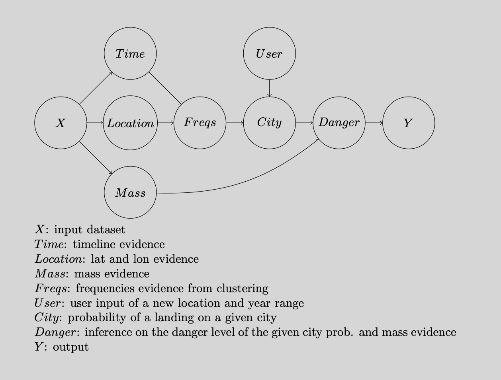
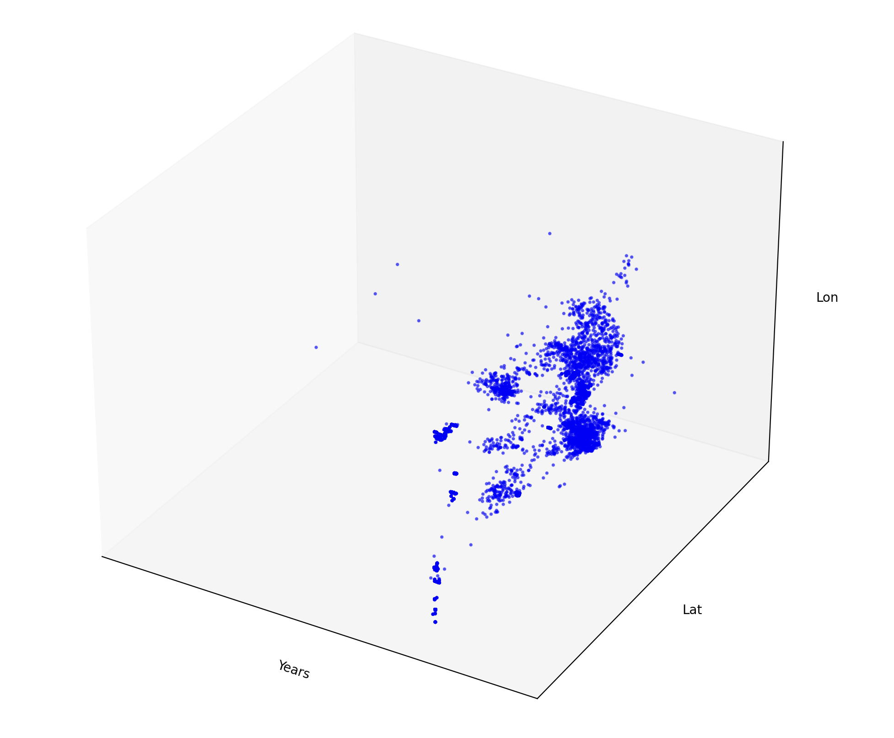
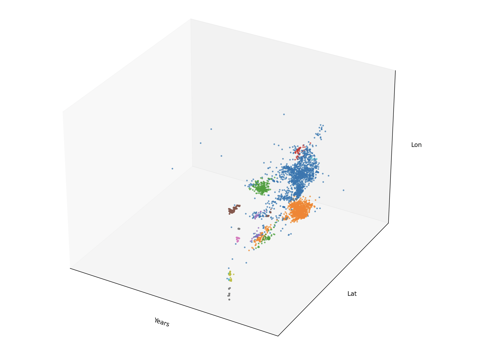

# Meteorite Hotspots
## Abstract
#### (Performance measure, Environment, Actuators, Sensors)
My agent's performance measure is inference on meteorite landings on a given location for the purpose of research and worldwide safety prediction by modeling how frequent these meteorites will fall and be considered dangerous based on a historical dataset. My agent will have an observable environment of planet earth, given geographical locations, a timeline, the masses of the meteorites, and more. My agent's actuators will be a predictive outcome on a meteorite landing based on the given evidence(clustered data, city location, etc.) and an inference classification on the danger level of such meteorite, all which can be modeled in a probabilistic way using a general pipeline of methods. Lastly, my agent will have sensors of gps (world map), time collection, and meteorite mass measurement.

## My agent's setup
Using the chosen dataset, the main features my model will be utilizing is mass, location, and a timeline of the metoerite landings since it's purpose is to predict the likelyhood of a meteorite landing on a given location, as well as additionally infering it's danger level given it's frequencies and mass. 

Here's the pipeline of methods in which the agent is structured by:


The pipeline starts with with mass, location , and timeline evidence preprocessed and extracted from the dataset. These are the baseline evidence methods the agent depends on for future computations.

Below is the mass method used to extract the mass feature from the dataset that will be used in the danger level computation later on.
```ruby
 # Mass evidence
    def mass_evidence(self, data):
        # relevant column for mass classifications
        extraction = [4]
        # skipping header
        data = [[meteor[i] for i in extraction] for meteor in data[1:]]
        # conversion to np array and removing imputies
        data = np.array([row for row in data if row[0].strip() != ''])
        data = data.astype(float)
        return data
```

On the other hand, the agent also requires a location and timeline method that will preproccess the required features (mass, lat, lon) for the clustering algorithm to classify and detect meteorite landing hotspots for the frequencies method of the pipeline.

```ruby
# Time and Location evidence
    def time_location_evidence(self, data):
        # relevant columns for multi-feature clustering (year and coordinate evidence)
        extraction = [6, 7, 8]
        # skipping header
        data = [[meteor[i] for i in extraction] for meteor in data[1:]]
        # conversion to np array and removing imputies
        data = np.array([row for row in data if row[0].strip() != '' and row[1].strip() != '' and row[2].strip() != '']).astype(float)
        return data
```
This method gives us the following 3 dimensional dataset:


After the preprocessing method has done it's work and extracted the mass, lat, lon features of the dataset required for the meteorite hotspot detection, then the frequencies method will perform one of the main computations of the agent, essential for the inference later on the pipeline. The frequencies method utilizes an modern unsupervised clustering algorithm known as DBSCAN, Density Based Clustering with Applications with noise. After training and doing a baseline comparison with a centriod based clustering algorithm (k-means), it showed promising results in meteor hotspot detection and outperformed k-means by 10-fold due to the noisy instances and complex clusters of the dataset. The algorithms hyperparameters eps and min_samples were set to 0.3 and 10, tuned for perfect cluster assignment. Note, the algorithms results were interpreted visually since the dataset is only 3 dimensional.

```ruby
# Frequencies evidence
    def frequencies(self, clean_data):
        # scaling for proper clustering
        scaler = StandardScaler()
        scaled = scaler.fit_transform(clean_data)
        # training model to 3D dataset
        model = DBSCAN(eps=0.3, min_samples=10)
        trained = model.fit(scaled)
        labels = trained.labels_
        return clean_data, labels
```
This method gives us the following labeled 3 dimensional dataset:


From here, the next method in the agents pipeline is a probablistic one that uses new user input (city location and year range) and the previous frequencies as evidence. Since DBSCAN can only perform hard assignment on each of the instances towards a cluster and the goal of the agent is to predict the likelihood of a new city instance_i (along with year) witnessing a meteor landing by soft assigning it to some pre-trained cluster_i, then the method will calculate such assignment using the density_i * weight_i of each cluster_i and collecting the highest, most probable assignment. The density of each cluster_i will be calculated using a SVM soft scoring kernel density estimator, specifically the Gaussian RBF kernel. This kernel allows for smooth and simple calculations (using euclidean distance, mean, variance, etc.) so that each cluster is assigneed a density, then using each of the clusters densities and their weights to get the highest likelihood that some instance_i belongs to a cluster_i in a probabilistic way beyond DBSCAN's capabilities. Keeping in mind the new instance x_i will be the location and year the user wants to make inference on.

```ruby
# Pr(City | Freqs)
    def city_given_freqs(self, x, data, labels):
        # collecting cluster information for inference
        clusters = {}
        total_points = len(labels)
        unique_labels = set(labels)
        unique_labels.discard(-1)
        for label in unique_labels:
            clust_points = data[labels == label]
            if len(clust_points) == 0:
                continue
            n = len(clust_points)
            mu = clust_points.mean(axis=0)
            sig = np.mean(np.linalg.norm(clust_points - mu, axis=1))
            # avoid errors
            if sig == 0 or np.isnan(sig):
                continue
            weight = n / total_points
            # labeling with dict
            clusters[label] = {
                'points': clust_points,
                'centroid': mu,
                'sigma': sig,
                'weight': weight
            }
        # ** Euclidean distance and Gaussian Radial Basis Function kernel**
        probs = {}
        for l, i in clusters.items():
            mu = i['centroid']
            sig = i['sigma']
            weight = i['weight']
            dist = np.sum((x - mu)**2)
            density = np.exp(-dist / (2 * sig**2))
            probs[l] = density * weight
        # normalizing probabilities
        total = sum(probs.values())
        if total == 0:
            return None, 0.0, []
        probs = {l: p / total for l, p in probs.items()}
        result_label = max(probs, key=probs.get)
        result_prob = probs[result_label]
        years = [int(p[0]) for p in clusters[result_label]['points']]
        years_min = min(years)
        years_max = max(years)
        return x, result_label, labels, result_prob, data, years_min, years_max
```

Finally, we can have more fun with the agent and infer the danger level of the user's new given location and year range by calculating the average of all the meteors masses of the soft assigned cluster.

```ruby
# danger level of the meteor
    def danger_given_city_and_mass(self, x, result_prob, label, labels, mass_data, cluster_data, ystart, yend):
        # collecting cluster point mass data
        label_points = cluster_data[labels == label]
        masses_label = [mass_data[p] for p in range(len(cluster_data))]
        masses_average = sum(masses_label) / len(masses_label)
        # categoritzing meteor masses
        if masses_average < 100:
            msg1 = "No Hazard -- Burns Up in Atmosphere"
        elif masses_average > 100 and masses_average < 10000:
            msg1 = "No Hazard -- Bright Fireball and Minor Atmospheric Explosion"
        elif masses_average > 10000 and masses_average < 1000000:
            msg1 = "Minor Risk -- Local Airburst and Possible Window Damage"
        elif masses_average > 1000000 and masses_average < 100000000:
            msg1 = "Local Risk -- Surface Explosion and Major Local damage"
        elif masses_average > 100000000 and masses_average < 1000000000:
            msg1 = "Regional Risk -- Crater Formation and Regional Distruction With Tsunami Potential"
        elif masses_average > 1000000000:
            msg1 = "Global Risk -- Absolute Annihilation and Mass Extinction"
        # final inference
        final_msg = "Location: ", x, "Probability: ", result_prob, "Mass Risk: ", msg1, "Years Range: ", ystart, "-", yend 
        return final_msg
```
## Implementation:
```ruby
# implementation
Agent1 = Agent()
# user city coordinates along with the year they want to infer
x_new = np.array([2000, 35.00, 139.00])
# pipeline
mass_result = Agent1.mass_evidence(MeteorData)
clean_result = Agent1.time_location_evidence(MeteorData)
data1, labels_result = Agent1.frequencies(clean_result)
point, lab, labs, prob, data2, ymin, ymax = Agent1.city_given_freqs(x_new, data1, labels_result)
final1 = Agent1.danger_given_city_and_mass(point, prob, lab, labs, mass_result, data2, ymin, ymax)
# printing final result
print(final1)
```
## Output:
```
('Location: ', array([2000.,   35.,  139.]), 'Probability: ', np.float64(0.5130764707086648), 'Mass Risk: ', 'Minor Risk -- Local Airburst and Possible Window Damage', 'Years Range: ', 1875, '-', 2011)
```

## Resources:

### DBSCAN Algorithm:
https://scikit-learn.org/stable/modules/generated/sklearn.cluster.DBSCAN.html

https://www.dbs.ifi.lmu.de/Publikationen/Papers/KDD-96.final.frame.pdf

### Helper Libraries:
https://scikit-learn.org/stable/modules/preprocessing.html

https://docs.python.org/3/library/csv.html

https://numpy.org/   

https://matplotlib.org/

### Full Code Script:
https://github.com/eduardolopez858/Meteorite-Hotspots/blob/main/model1.py

### Nasa Meteorite Dataset:
https://github.com/eduardolopez858/Meteorite-Hotspots/blob/main/meteorite-landings.csv

https://www.kaggle.com/datasets/nasa/meteorite-landings
